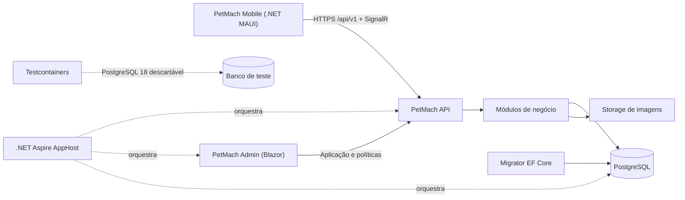
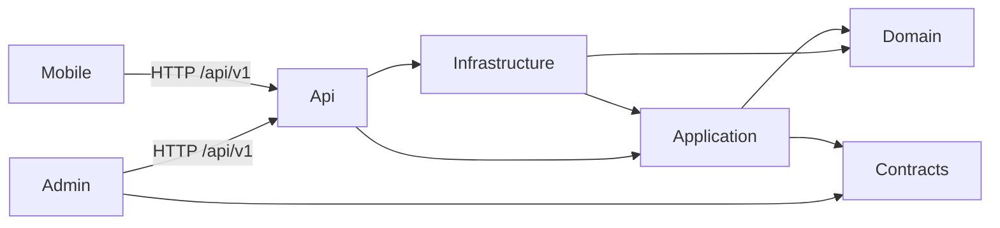
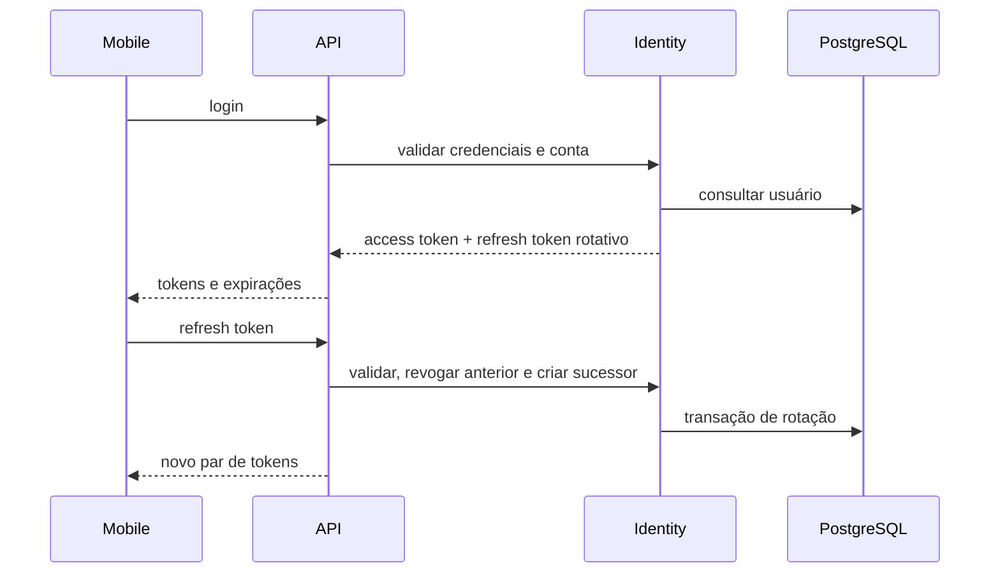
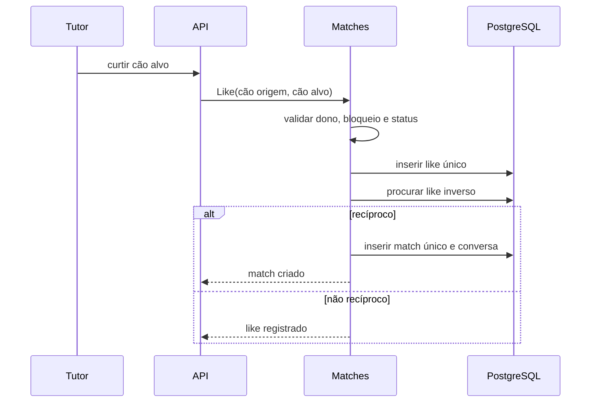
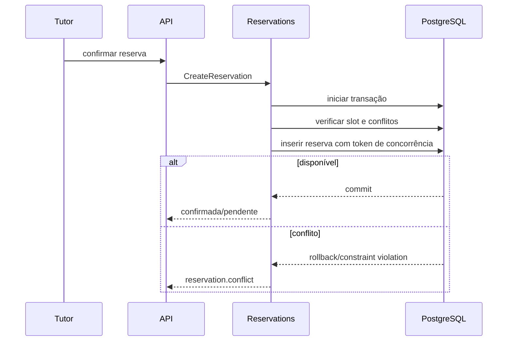

# Arquitetura atual

## Direção

O PetMach é um monólito modular implantável como uma API principal, um painel
Admin separado e um cliente mobile. O backend compartilha o banco PostgreSQL,
mas mantém limites de módulos verificáveis. A separação `backend/` e
`frontend/` é física; contratos HTTP versionados são a fronteira entre ambos.



## Estrutura real

```text
PetMach/
├── AGENTS.md
├── README.md
├── PetMach.code-workspace
├── PetMach.slnx
├── global.json
├── Directory.Build.props
├── Directory.Packages.props
├── docker-compose.yml
├── .editorconfig
├── .gitignore
├── backend/
│   ├── src/
│   │   ├── PetMach.Api/
│   │   ├── PetMach.Domain/
│   │   ├── PetMach.Application/
│   │   ├── PetMach.Infrastructure/
│   │   ├── PetMach.Contracts/
│   │   ├── PetMach.Admin/
│   │   ├── PetMach.AppHost/
│   │   └── PetMach.ServiceDefaults/
│   └── tests/
│       ├── PetMach.Domain.Tests/
│       ├── PetMach.Application.Tests/
│       ├── PetMach.Api.IntegrationTests/
│       └── PetMach.Architecture.Tests/
├── frontend/
│   ├── src/PetMach.Mobile.Core/
│   ├── src/PetMach.Mobile/
│   └── tests/PetMach.Mobile.Tests/
└── docs/
    ├── api/
    ├── decisions/
    ├── current-state.md
    ├── operations.md
    └── testing.md
```

Os projetos de backend usam pastas de primeiro nível por módulo (`Identity`, `Tutors`, `Dogs` etc.) em Domain, Application e Infrastructure. Isso preserva as quatro dependências arquiteturais sem criar dezenas de assemblies no início. Testes arquiteturais impedem dependências proibidas. Se o acoplamento crescer, um módulo pode ser extraído para assemblies próprios sem alterar seus contratos externos.

## Regra de dependências



- Domain não depende de Application, Infrastructure, API ou UI.
- Application orquestra casos de uso e portas; não conhece EF Core ou transporte HTTP.
- Infrastructure implementa persistência, Identity, storage, relógio e integrações.
- API autentica, autoriza, valida transporte e converte resultados em Problem Details.
- Contracts contém DTOs públicos estáveis, paginação e eventos de integração deliberados; nunca entidades.
- Admin referencia Contracts para interpretar respostas, mas acessa operações de
  negócio somente pela API.
- Mobile mantém modelos de transporte próprios no núcleo compartilhado, consome
  a API e não referencia projetos internos do backend.

## Módulos

| Módulo | Responsabilidade | Dependências permitidas relevantes |
|---|---|---|
| SharedKernel | IDs, Result, erros, abstrações mínimas e eventos | Nenhuma regra de módulo |
| Identity | credenciais, papéis, consentimento, tokens e ciclo da conta | Notifications, Audit por portas |
| Tutors | perfil do tutor e privacidade | Identity por identificador |
| Dogs | perfil, fotos, raça, preferências e status | Tutors |
| Health | vacina, vermifugação e saúde protegida | Dogs |
| Discovery | candidatos, filtros e distância aproximada | Dogs, Tutors, Health, Moderation |
| Matches | likes, reciprocidade, match e unmatch | Dogs, Moderation, Notifications |
| Chat | conversa, mensagens, leitura e SignalR | Matches, Moderation, Notifications |
| Meetings | propostas e transições de encontro | Matches, Partners, Reservations |
| Partners | estabelecimento, representante, serviços e horários | Identity, Administration |
| Spaces | espaço, recursos, regras e slots | Partners |
| Reservations | disponibilidade, participantes, conflito e histórico | Spaces, Dogs, Notifications |
| Adoption | perfis e histórico independente de likes | Dogs, Moderation, Notifications |
| Notifications | caixa interna e porta para push futuro | Identity |
| Moderation | bloqueios, denúncias, evidências e ações | Identity, Audit |
| Administration | consultas administrativas, parâmetros e políticas | Todos por casos de uso públicos |

As dependências da tabela são relações de negócio, não autorização para ler tabelas internas. Administração usa projeções/casos de uso explícitos.

## Persistência

- Um PostgreSQL por implantação e um `DbContext` inicial, com mapeamentos agrupados por módulo e schemas lógicos por módulo quando isso não prejudicar Identity/migrations.
- Dezoito migrations ordenadas no projeto Infrastructure formam o schema
  atual. No Compose, um migrator dedicado as aplica antes de liberar a API.
- Constraints e índices garantem invariantes concorrentes que validação de aplicação não consegue garantir.
- `Guid` gerado pela aplicação como identificador uniforme; `DateTimeOffset` UTC para eventos.
- Localização começa com tipos/consultas PostgreSQL adequados e cálculo no servidor. PostGIS somente após validação de necessidade e disponibilidade operacional.
- Redis não é fonte de verdade e não entra no caminho crítico inicial.

Testes de persistência usam a imagem fixada `postgres:18.0-alpine` via
Testcontainers, aplicam todas as migrations e limpam dados entre casos. Docker
indisponível falha a fixture explicitamente; não existe aprovação silenciosa,
`EnsureCreated`, SQLite ou EF Core InMemory nesse caminho.

## API e erros

- Prefixo `/api/v1`, OpenAPI nativo e paginação por cursor onde há fluxo cronológico; paginação por página somente em consultas administrativas adequadas.
- Requests possuem validadores e mapeamento explícito para comandos/casos de uso.
- Erros seguem RFC 9457 Problem Details com códigos estáveis (`dog.not_found`, `reservation.conflict`).
- Autorização combina papéis e políticas baseadas em recurso; a checagem de participante permanece no caso de uso.
- Idempotência será aplicada a confirmações de reserva e outras escritas suscetíveis a repetição do cliente.

## Fluxos críticos

### Autenticação



### Match



### Reserva



## Observabilidade

Aspire Service Defaults configura OpenTelemetry, health checks e service discovery. Cada requisição recebe correlation/trace ID. Métricas evitam dimensões com usuário, coordenada ou conteúdo de mensagem. Logs estruturados registram ação, resultado e identificadores técnicos necessários, nunca segredos ou saúde sensível.

No Compose, PostgreSQL usa `pg_isready`; API e Admin expõem `/health/live` e
`/health/ready`. A readiness da API inclui `PetMachDbContext`, portanto também
confirma a conexão API → PostgreSQL. A ordem de prontidão é PostgreSQL saudável,
migrator concluído, API saudável e Admin saudável.

## Navegação e sessão Mobile

O Mobile inicia com uma raiz pública criada por `RootNavigationService`.
Restauração ou autenticação válida substitui a raiz por uma nova instância
transiente de `AppShell`; logout ou invalidação substitui novamente por uma
nova raiz pública. Nenhuma página MAUI é singleton.

Tokens passam exclusivamente por `ITokenStore`/`SecureStorage`. Renovações
simultâneas compartilham uma única operação, e uma requisição protegida recebe
no máximo uma repetição após `401`. Login e refresh usam `AuthApiClient`,
separado do mecanismo de repetição das chamadas protegidas.

## Formas de orquestração

- **local:** processos API/Admin via `dotnet run`, PostgreSQL local ou container
  e migrations EF explícitas;
- **Docker Compose:** PostgreSQL, migrator, API e Admin em containers, com
  dependências condicionadas por saúde/conclusão;
- **Aspire:** PostgreSQL, API e Admin para desenvolvimento, com referências,
  service discovery e dashboard.

Os Dockerfiles finais executam com o `APP_UID` não privilegiado fornecido pelas
imagens oficiais .NET 10. Consulte [Operação e execução](operations.md).

## Evolução

Os primeiros candidatos à extração futura são Chat/Notifications (escala de conexões) e Reservations (isolamento transacional/comercial). Extração exige métrica, contrato de integração, outbox/idempotência e ADR; não faz parte do MVP.
