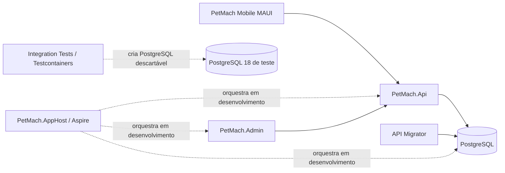
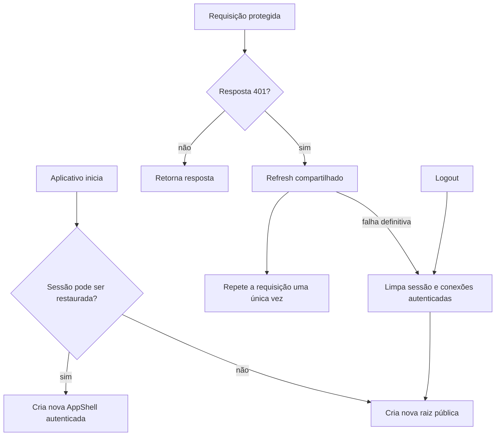
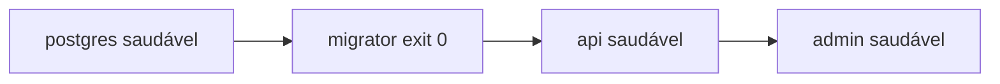

# Estado técnico atual

Este documento é a referência do estado implementado do PetMach. Os relatórios
`phase-*.md` registram o resultado observado em cada data e podem mencionar
limitações que já foram removidas em incrementos posteriores.

## Visão geral do produto

O PetMach é uma plataforma para tutores criarem perfis de pets, descobrirem
outros animais, formarem matches, conversarem e combinarem encontros. O produto
também mantém uma área separada de adoção responsável, reservas em espaços
parceiros e moderação administrativa.

| Componente | Responsabilidade atual |
|---|---|
| API | Expõe contratos HTTP em `/api/v1`, autenticação, autorização, regras de acesso, SignalR e health checks. |
| Mobile | Aplicativo .NET MAUI para tutores, com sessão segura, descoberta, matches, conversas, encontros, parceiros, reservas, adoção e denúncias. |
| Admin | Aplicação Blazor Interactive Server para autenticação administrativa, fila de denúncias, evidências protegidas e ações de moderação. |
| PostgreSQL | Fonte de verdade para Identity e módulos de negócio; recebe o schema por 18 migrations EF Core. |
| Docker Compose | Orquestra PostgreSQL, migrator, API e Admin com dependências baseadas em prontidão. |
| Aspire | Orquestra PostgreSQL, API e Admin no ambiente de desenvolvimento, com service discovery e observabilidade. |
| Testes | Cobrem domínio, aplicação, arquitetura, API, Mobile e persistência/concorrência em PostgreSQL real via Testcontainers. |

## Arquitetura da solução

O backend é um monólito modular. API e Admin são processos separados, mas as
regras e a persistência permanecem organizadas pelas camadas Domain,
Application, Contracts e Infrastructure. O Mobile consome contratos HTTP; ele
não referencia o domínio nem acessa o banco.

### Projetos da solução

| Projeto | Papel |
|---|---|
| `PetMach.Domain` | Entidades, estados, invariantes e erros de domínio. |
| `PetMach.Application` | Portas, validadores e coordenação dos casos de uso. |
| `PetMach.Contracts` | Requests e responses públicos da API. |
| `PetMach.Infrastructure` | EF Core, Npgsql, Identity, JWT, storage local de desenvolvimento e serviços dos módulos. |
| `PetMach.Api` | Controllers, SignalR, autenticação/autorização, Problem Details, OpenAPI e endpoints de saúde. |
| `PetMach.Admin` | Painel Blazor server-side para moderação e administração. |
| `PetMach.ServiceDefaults` | Health checks, OpenTelemetry, resiliência HTTP e service discovery. |
| `PetMach.AppHost` | Orquestração local por .NET Aspire. |
| `PetMach.Mobile.Core` | ViewModels, clientes HTTP, sessão e navegação testáveis sem a plataforma MAUI. |
| `PetMach.Mobile` | Páginas XAML, host MAUI, integrações de plataforma, SignalR e `SecureStorage`. |

A solução contém quatro projetos de testes no backend e um no frontend:

- `PetMach.Domain.Tests`;
- `PetMach.Application.Tests`;
- `PetMach.Architecture.Tests`;
- `PetMach.Api.IntegrationTests`;
- `PetMach.Mobile.Tests`.

## Módulos funcionais implementados

- identidade, consentimentos, JWT e refresh token rotativo;
- perfil do tutor, pets, fotos e saúde;
- descoberta, filtros, likes, passes, matches, notificações e bloqueios;
- chat persistente, SignalR, leitura e encontros;
- parceiros, espaços, disponibilidade e reservas;
- adoção responsável e candidaturas;
- denúncias, evidências protegidas, moderação, auditoria e Admin.

Adoção continua separada do fluxo de likes. Pagamento real, reprodução,
chamadas, áudio e vídeo não fazem parte do MVP.

## Persistência e migrations

`PetMachDbContext`, no projeto Infrastructure, usa EF Core com Npgsql. Existem
18 migrations versionadas. PostgreSQL protege invariantes concorrentes com
constraints e índices, incluindo unicidade de reservas ativas por
disponibilidade e de candidatura aprovada por publicação de adoção.

No Compose, o serviço `migrator` usa o target homônimo do Dockerfile da API,
executa `dotnet ef database update` e termina com sucesso antes da API iniciar.
A API não disputa a aplicação de migrations com outras instâncias.

Em execução local ou Aspire, aplique migrations explicitamente conforme
[Operação e execução](operations.md).

## Sessão e navegação Mobile

O Mobile guarda access token e refresh token somente pela abstração
`ITokenStore`, cuja implementação MAUI usa `SecureStorage`.

As páginas MAUI e `AppShell` são transientes. Toda troca da raiz da janela passa
por `RootNavigationService`; cada autenticação cria uma nova `AppShell`, e
logout ou sessão inválida criam uma nova raiz pública. Renovações simultâneas
compartilham uma única chamada de refresh. Uma chamada protegida é repetida no
máximo uma vez depois de `401`; login e refresh usam o cliente de autenticação
separado e não entram nesse ciclo.

Por padrão, Debug Android usa `http://10.0.2.2:5049/`, endereço do host visto
pelo emulador. `PETMACH_API_BASE_URL` permite fornecer outra URL absoluta e não
é um segredo.

## Admin

O Admin consome a API por `PetMachApi:BaseUrl`. Em desenvolvimento local, o
padrão é `http://localhost:5049/`; no Compose é `http://api:8080/`.

O login valida o papel `Administrator` ou `Moderator`. A sessão usa cookie
HTTP-only, `SameSite=Strict` e expira junto do access token. Mutações usam
antiforgery, e evidências são entregues por proxy autenticado sem expor token
ou chave física de storage ao navegador.

## Docker e segurança do runtime

Os Dockerfiles da API e do Admin usam build multi-stage sobre imagens oficiais
.NET 10. Os processos finais executam com o `APP_UID` não privilegiado fornecido
pela imagem oficial; não criam usuário com `adduser` ou `useradd`.

O contexto de build exclui repositório Git, SDKs locais, testes, frontend,
documentação, `bin`, `obj`, resultados e artefatos temporários por meio do
`.dockerignore`. Segredos devem ser fornecidos em `.env` local não versionado ou
por variáveis do ambiente.

## Health checks e prontidão

- PostgreSQL: `pg_isready`;
- API: `GET /health/ready`, incluindo a verificação do `PetMachDbContext`;
- Admin: `GET /health/ready`;
- liveness de API e Admin: `GET /health/live`.

No Compose, a sequência é:

## Testes PostgreSQL reais

Os cinco testes marcados com `Category=PostgreSQL` usam uma fixture xUnit
compartilhada e a imagem fixada `postgres:18.0-alpine`. A fixture:

1. gera credenciais efêmeras;
2. inicia um container por coleção;
3. aplica as 18 migrations com `MigrateAsync`;
4. limpa as tabelas entre testes, preservando `__EFMigrationsHistory`;
5. valida conexão real, migrations, isolamento e constraints concorrentes;
6. descarta o container ao terminar.

Docker indisponível produz falha explícita da fixture. Não há retorno antecipado
nem aprovação silenciosa. Consulte [Testes](testing.md).

## Operação

Os comandos atuais para execução local, Compose, Aspire e Android estão em
[Operação e execução](operations.md). Os relatórios de fases permanecem úteis
como histórico de evolução, mas este documento e o README prevalecem para o
estado técnico e os comandos atuais.
