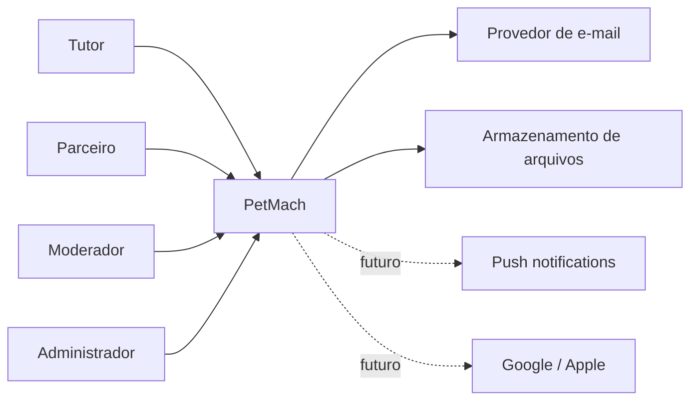
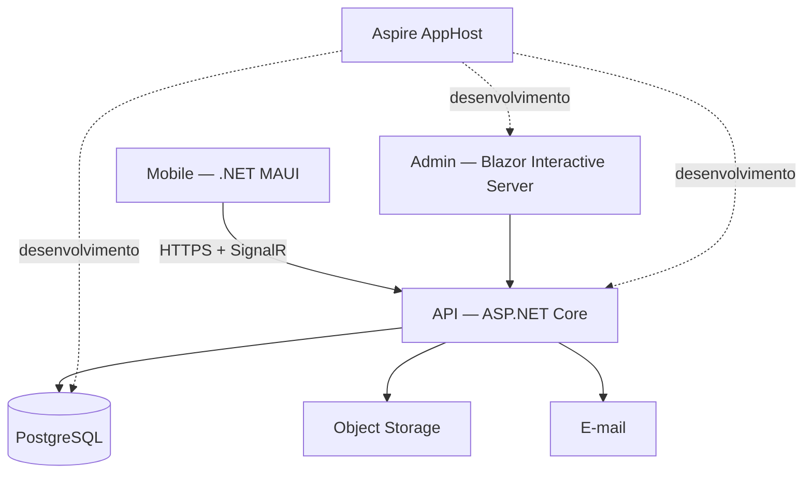
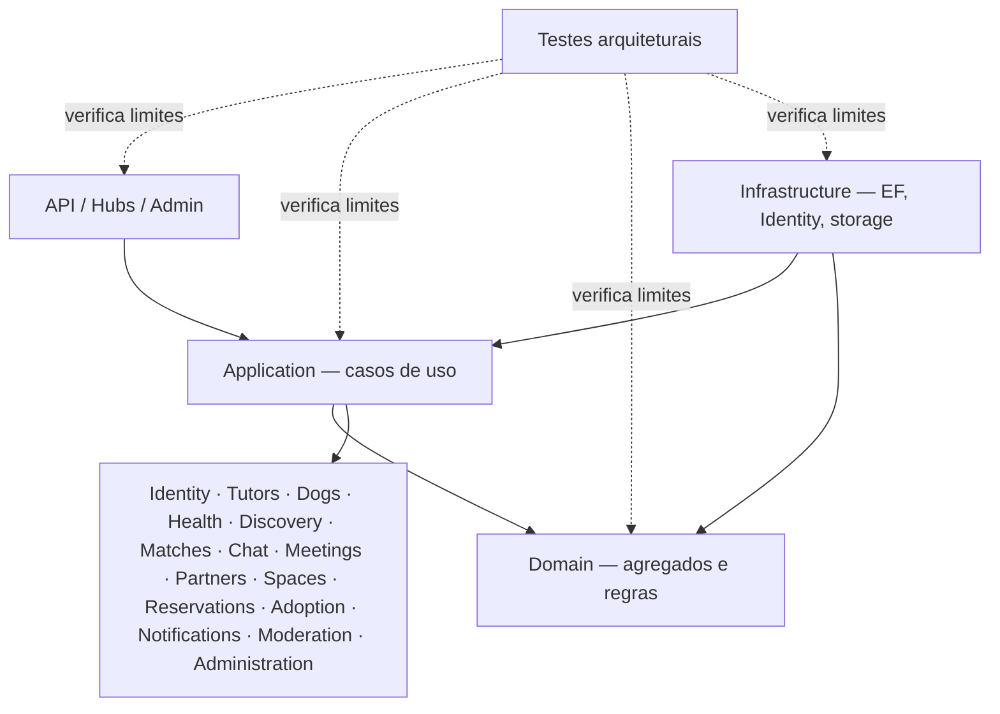
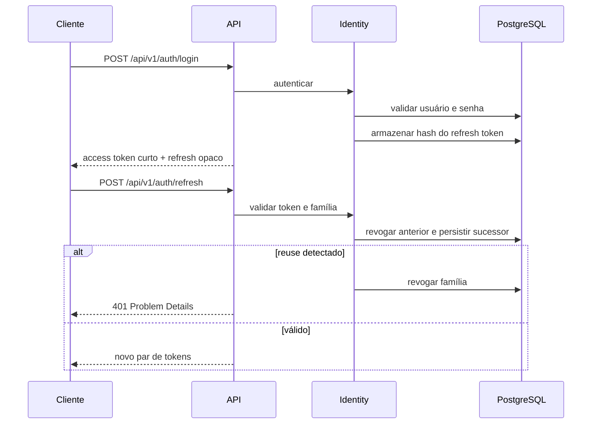
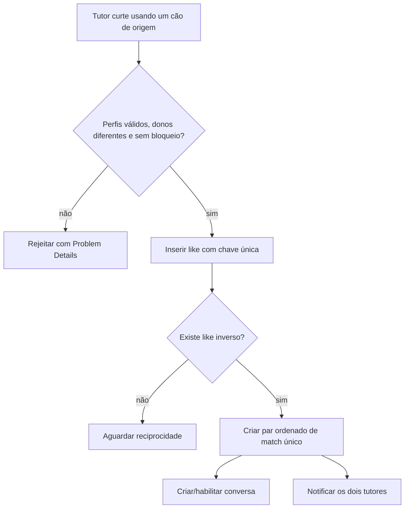
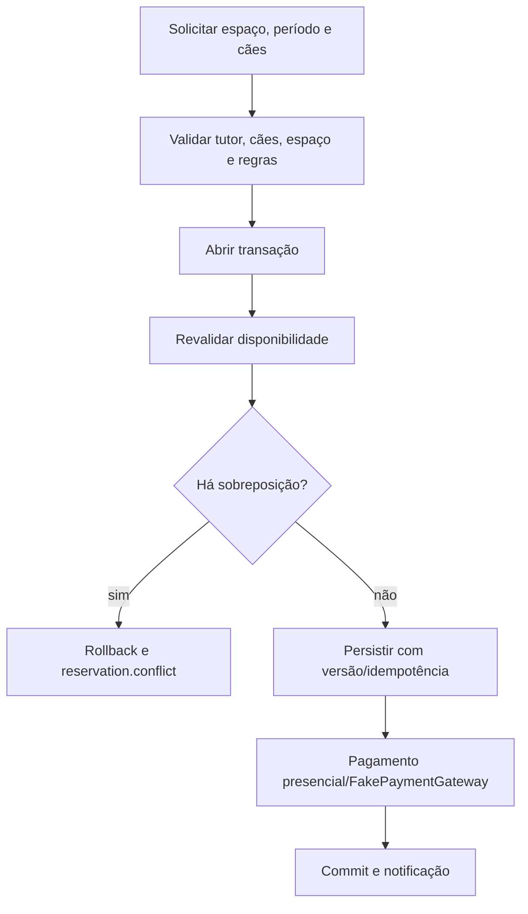
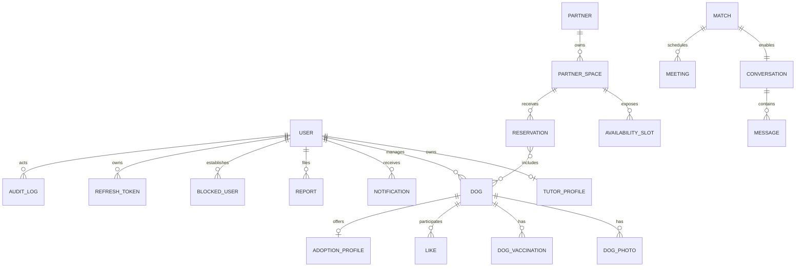

# Diagramas da solução

## 1. Contexto

```mermaid
flowchart LR
    Tutor["Tutor"] --> PetMach["PetMach"]
    Partner["Parceiro"] --> PetMach
    Moderator["Moderador"] --> PetMach
    Administrator["Administrador"] --> PetMach
    PetMach --> Email["Provedor de e-mail"]
    PetMach --> Storage["Armazenamento de arquivos"]
    PetMach -. futuro .-> Push["Push notifications"]
    PetMach -. futuro .-> ExternalLogin["Google / Apple"]
```

## 2. Containers

```mermaid
flowchart TB
    Mobile["Mobile — .NET MAUI"] -->|"HTTPS + SignalR"| Api["API — ASP.NET Core"]
    Admin["Admin — Blazor Interactive Server"] --> Api
    Api --> Db[("PostgreSQL")]
    Api --> Files["Object Storage"]
    Api --> Mail["E-mail"]
    Aspire["Aspire AppHost"] -. desenvolvimento .-> Api
    Aspire -. desenvolvimento .-> Admin
    Aspire -. desenvolvimento .-> Db
```

## 3. Componentes do backend

```mermaid
flowchart TB
    Transport["API / Hubs / Admin"] --> App["Application — casos de uso"]
    App --> Domain["Domain — agregados e regras"]
    Infra["Infrastructure — EF, Identity, storage"] --> App
    Infra --> Domain
    App --> Modules["Identity · Tutors · Dogs · Health · Discovery · Matches · Chat · Meetings · Partners · Spaces · Reservations · Adoption · Notifications · Moderation · Administration"]
    Tests["Testes arquiteturais"] -. verifica limites .-> Transport
    Tests -. verifica limites .-> App
    Tests -. verifica limites .-> Domain
    Tests -. verifica limites .-> Infra
```

## 4. Autenticação e refresh

```mermaid
sequenceDiagram
    participant C as Cliente
    participant A as API
    participant I as Identity
    participant D as PostgreSQL
    C->>A: POST /api/v1/auth/login
    A->>I: autenticar
    I->>D: validar usuário e senha
    I->>D: armazenar hash do refresh token
    A-->>C: access token curto + refresh opaco
    C->>A: POST /api/v1/auth/refresh
    A->>I: validar token e família
    I->>D: revogar anterior e persistir sucessor
    alt reuse detectado
        I->>D: revogar família
        A-->>C: 401 Problem Details
    else válido
        A-->>C: novo par de tokens
    end
```

## 5. Match recíproco

```mermaid
flowchart TD
    Like["Tutor curte usando um cão de origem"] --> Validate{"Perfis válidos, donos diferentes e sem bloqueio?"}
    Validate -- não --> Reject["Rejeitar com Problem Details"]
    Validate -- sim --> Insert["Inserir like com chave única"]
    Insert --> Reciprocal{"Existe like inverso?"}
    Reciprocal -- não --> Await["Aguardar reciprocidade"]
    Reciprocal -- sim --> Match["Criar par ordenado de match único"]
    Match --> Conversation["Criar/habilitar conversa"]
    Match --> Notify["Notificar os dois tutores"]
```

## 6. Reserva

```mermaid
flowchart TD
    Request["Solicitar espaço, período e cães"] --> Authorize["Validar tutor, cães, espaço e regras"]
    Authorize --> Transaction["Abrir transação"]
    Transaction --> Recheck["Revalidar disponibilidade"]
    Recheck --> Conflict{"Há sobreposição?"}
    Conflict -- sim --> Rollback["Rollback e reservation.conflict"]
    Conflict -- não --> Persist["Persistir com versão/idempotência"]
    Persist --> FakePayment["Pagamento presencial/FakePaymentGateway"]
    FakePayment --> Commit["Commit e notificação"]
```

## 7. Modelo inicial de dados

```mermaid
erDiagram
    USER ||--o| TUTOR_PROFILE : owns
    USER ||--o{ DOG : manages
    DOG ||--o{ DOG_PHOTO : has
    DOG ||--o{ DOG_VACCINATION : has
    DOG ||--o{ LIKE : participates
    MATCH ||--|| CONVERSATION : enables
    CONVERSATION ||--o{ MESSAGE : contains
    MATCH ||--o{ MEETING : schedules
    PARTNER ||--o{ PARTNER_SPACE : owns
    PARTNER_SPACE ||--o{ AVAILABILITY_SLOT : exposes
    PARTNER_SPACE ||--o{ RESERVATION : receives
    RESERVATION }o--o{ DOG : includes
    DOG ||--o| ADOPTION_PROFILE : offers
    USER ||--o{ NOTIFICATION : receives
    USER ||--o{ REPORT : files
    USER ||--o{ BLOCKED_USER : establishes
    USER ||--o{ REFRESH_TOKEN : owns
    USER ||--o{ AUDIT_LOG : acts
```
