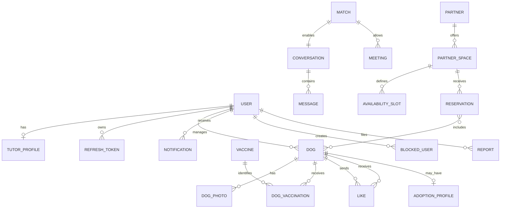

# Modelo de domínio inicial

## Estratégias comuns

- Identificadores: `Guid` não vazio, gerado na aplicação.
- Tempo: `DateTimeOffset` normalizado para UTC; relógio injetável.
- Concorrência: token/version em reservas e agregados com edição concorrente relevante.
- Exclusão: preferir estados explícitos e anonimização; soft delete somente onde retenção/histórico exigir.

## Agregados e entidades

| Agregado | Entidades/VOs principais | Invariantes iniciais |
|---|---|---|
| User | User, RefreshToken, ConsentRecord | e-mail normalizado único; refresh de uso único e rotativo; conta suspensa não autentica |
| TutorProfile | TutorProfile, PrivacyPreferences | um perfil por User tutor; nascimento não futuro; localização oculta por escolha |
| Dog | Dog, DogPhoto, Preference; Breed como catálogo | pertence a um tutor; foto principal pertence à galeria; objetivo não inclui reprodução |
| DogHealth | DogVaccination, Vaccine, DewormingRecord | acesso privado por padrão; datas coerentes; comprovante protegido |
| Like/Match | Like, Match | cães distintos e de tutores distintos; par ordenado único; reciprocidade necessária |
| Conversation | Conversation, Message | criada para match; somente participantes; mensagem paginada e imutável salvo moderação explícita |
| Meeting | Meeting | somente participantes do match; transições de estado válidas; local parceiro preferencial |
| Partner | Partner, PartnerUser | identificador fiscal único quando aplicável; somente representante autorizado altera |
| PartnerSpace | PartnerSpace, AvailabilitySlot | pertence a parceiro ativo; capacidade/duração/valor válidos |
| Reservation | Reservation, ReservationDog | sem sobreposição para espaço/período; cães pertencem a participantes; cancelamento preserva histórico |
| AdoptionProfile | AdoptionProfile, AdoptionStatusHistory | fluxo independente de likes; termo aceito; transição auditada |
| Notification | Notification | destinatário obrigatório; leitura monotônica; payload sem segredo |
| Report | Report, ReportEvidence, ModerationAction | alvo/tipo/motivo válidos; evidência protegida; ação auditada |
| BlockedUser | BlockedUser | par de usuários único; bloqueador diferente do bloqueado; efeito imediato |
| AuditLog | AuditLog | append-only; ator, ação, alvo, instante e resultado; sem dados sensíveis |

## Estados principais

- `AccountStatus`: PendingConfirmation, Active, Suspended, Anonymized.
- `DogProfileStatus`: Draft, Active, Hidden, Suspended, Removed.
- `DogGoal`: Friendship, Socialization, Walks, Events, Adoption.
- `MeetingStatus`: Proposed, Accepted, Rejected, Cancelled, Completed.
- `ReservationStatus`: Pending, Confirmed, Cancelled, Completed, NoShow.
- `AdoptionStatus`: Available, InProgress, Adopted, Suspended.
- `ReportStatus`: Submitted, UnderReview, Actioned, Dismissed.

## Relacionamentos conceituais

## Limites ainda não fechados

- `Breed` pode ser catálogo administrável global, não agregado de Dog.
- Conversation pode nascer atomicamente com Match ou sob demanda na primeira mensagem; decisão pendente.
- Slots podem representar janelas recorrentes mais exceções, e não linhas para cada horário; requer regra comercial.
- Pedido/candidatura de adoção não aparece nominalmente no modelo fornecido, mas os testes obrigatórios citam “pedido de adoção”; precisa ser definido antes da Fase 7.
